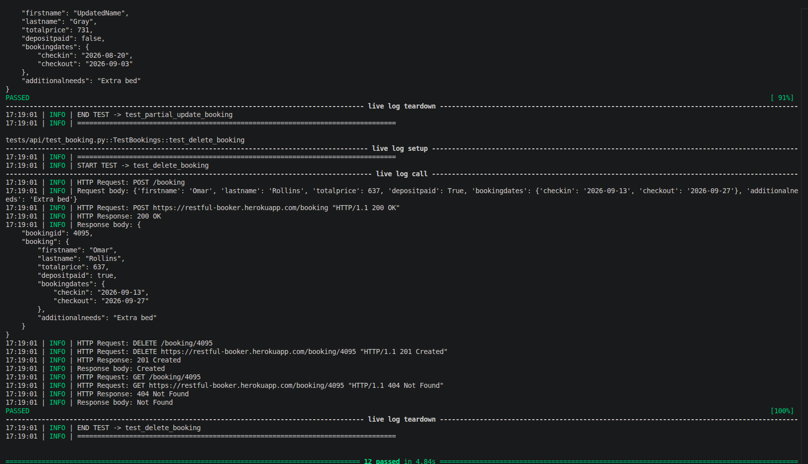
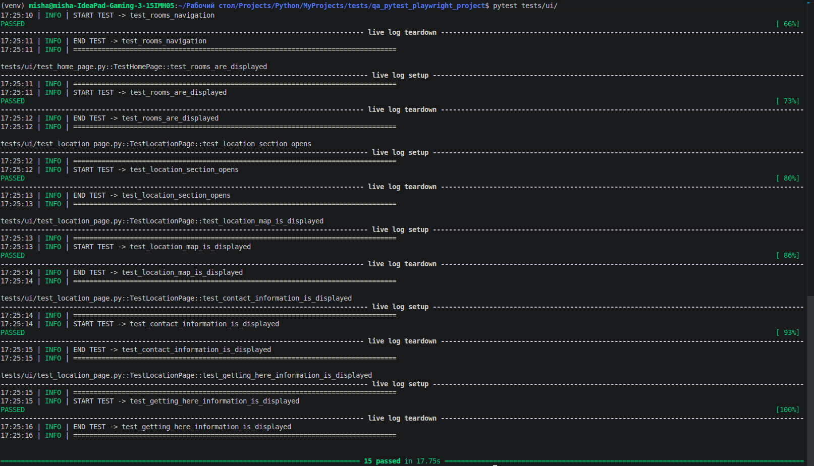
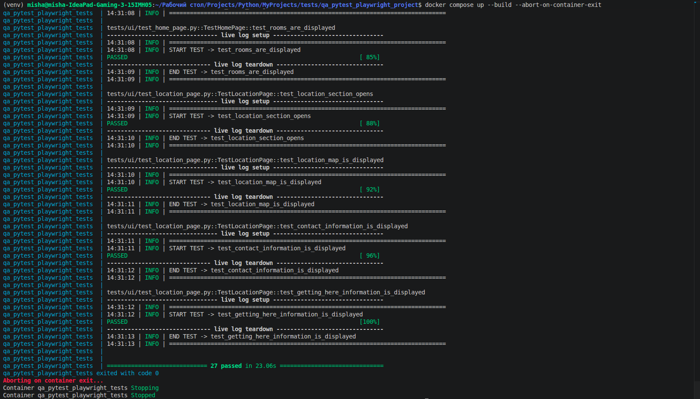
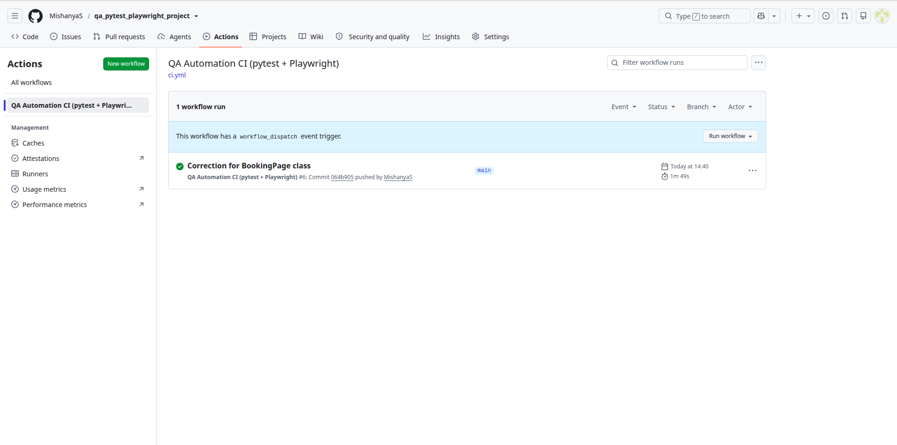
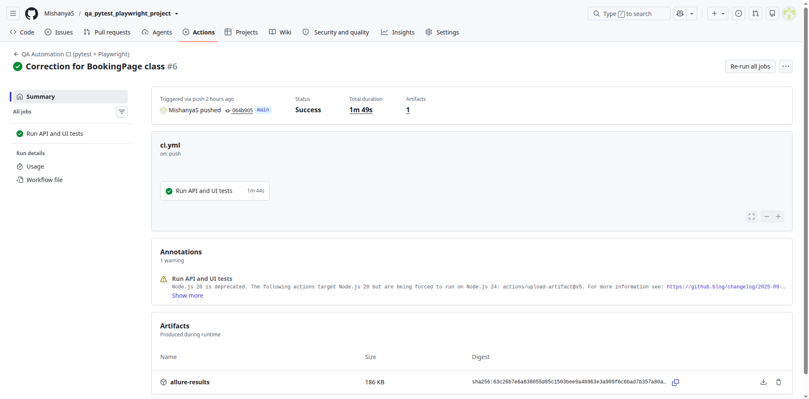

# QA Automation Framework (pytest + Playwright)


## About the Project

A **Python-based QA Automation Framework** designed for automated **API and UI testing**.

The project demonstrates a structured approach to test automation, including:

* API client abstraction
* Page Object Model for UI automation
* JSON Schema response validation
* reusable pytest fixtures
* test parametrization
* test markers
* generated test data with Faker
* Allure reporting
* screenshots and logs
* static code analysis and formatting
* type checking with mypy
* Docker-based test execution
* CI automation with GitHub Actions

The framework is designed as a portfolio project demonstrating practical **QA Automation Engineer** skills.

---

## Tech Stack

| Technology                  | Purpose                                               |
| --------------------------- | ----------------------------------------------------- |
| **Python 3.12**             | Main programming language                             |
| **Pytest**                  | Test framework, fixtures, parametrization and markers |
| **HTTPX**                   | HTTP/API testing                                      |
| **Playwright**              | UI test automation                                    |
| **JSON Schema**             | API response contract validation                      |
| **Allure**                  | Test reporting                                        |
| **Faker**                   | Test data generation                                  |
| **Ruff**                    | Linting and code quality                              |
| **Black**                   | Code formatting                                       |
| **mypy**                    | Static type checking                                  |
| **Docker / Docker Compose** | Containerized test execution                          |
| **GitHub Actions**          | CI automation                                         |
| **Git / GitHub**            | Version control                                       |

---

## Testing Scope

The framework contains two main test layers.

### API Tests

API tests validate the **Restful Booker API**.

```text
tests/api/
```

The API test suite covers:

* authentication
* `GET`
* `POST`
* `PUT`
* `PATCH`
* `DELETE`
* positive scenarios
* negative scenarios
* request payload validation
* response status codes
* response body validation
* JSON Schema validation
* parametrized tests
* generated test data

API tests use reusable fixtures and API client abstraction.

Example flow:

```text
Test
 ↓
API Client
 ↓
HTTP Request
 ↓
Response
 ↓
Status Code Validation
 ↓
JSON Validation
 ↓
JSON Schema Validation
```

API clients:

```text
api/
├── base_client.py
├── auth_client.py
└── booking_client.py
```

#### API tests result


---

### UI Tests

UI tests use **Playwright** and follow the **Page Object Model**.

```text
tests/ui/
pages/
```

The UI suite covers the **Shady Meadows B&B** web application, including:

* Home page
* Booking page
* Contact section
* Location section
* booking form
* booking dates
* available rooms
* room booking
* contact form
* navigation
* location information
* map and location marker

The Page Object approach keeps locators and page interaction logic separated from test scenarios.

Example flow:

```text
Test
 ↓
Page Object
 ↓
Playwright
 ↓
Browser
 ↓
Assertion
```

Page Objects:

```text
pages/
├── base_page.py
├── home_page.py
├── booking_page.py
├── contact_page.py
└── location_page.py
```

#### UI tests result


---

## Test Architecture

```text
                    QA Automation Framework
                              │
                 ┌────────────┴────────────┐
                 │                         │
                 ▼                         ▼
             API Tests                 UI Tests
                 │                         │
                 ▼                         ▼
            API Clients              Page Objects
                 │                         │
                 ▼                         ▼
              HTTPX                   Playwright
                 │                         │
                 └────────────┬────────────┘
                              │
                              ▼
                           Pytest
                              │
                 ┌────────────┼────────────┐
                 ▼            ▼            ▼
              Allure      Screenshots     Logs
                              │
                              ▼
                       GitHub Actions
```

---

## Project Structure

```text
.
├── .github/
│   └── workflows/
│       └── ci.yml
│
├── api/
│   ├── auth_client.py
│   ├── base_client.py
│   └── booking_client.py
│
├── models/
│   └── booking.py
│
├── pages/
│   ├── base_page.py
│   ├── booking_page.py
│   ├── contact_page.py
│   ├── home_page.py
│   └── location_page.py
│
├── schemas/
│   ├── auth_schema.py
│   └── booking_schema.py
│
├── tests/
│   ├── api/
│   │   ├── test_authentication.py
│   │   └── test_booking.py
│   │
│   └── ui/
│       ├── test_booking_page.py
│       ├── test_contact_page.py
│       ├── test_home_page.py
│       └── test_location_page.py
│
├── utils/
│   ├── data_generator.py
│   └── response_helpers.py
│
├── .dockerignore
├── .env.example
├── .gitignore
├── Dockerfile
├── docker-compose.yml
├── config.py
├── conftest.py
├── pyproject.toml
└── README.md
```

---

## Code Quality

The project uses automated static analysis, formatting, and type checking.

### Ruff

```bash
ruff check .
```

### Black

```bash
black --check .
```

### mypy

```bash
mypy .
```

These tools help maintain consistent code style, detect common Python issues and verify static typing.

---

## Docker

The project supports containerized test execution using Docker and Docker Compose.

Build the Docker image:

```bash
docker compose build
```

Run all tests:

```bash
docker compose run --rm tests
```

Run API tests:

```bash
docker compose run --rm tests pytest tests/api
```

Run UI tests:

```bash
docker compose run --rm tests pytest tests/ui
```

Docker provides a reproducible test environment with the required **Python, Playwright and browser dependencies**.

#### Tests running with help of Docker Compose


---

## GitHub Actions

The CI pipeline automatically runs on:

* push to `main`
* push to `master`
* push to `develop`
* pull requests
* manual workflow execution

### Pipeline

```text
Checkout
   ↓
Create .env
   ↓
Build Docker Image
   ↓
API Tests
   ↓
UI Tests
   ↓
Full Test Suite
   ↓
Upload Allure Results
   ↓
Upload Screenshots
   ↓
Upload Logs
   ↓
Docker Cleanup
```

The CI environment runs Playwright tests in **headless mode** inside Docker.

Test artifacts are uploaded after execution, including:

* Allure results
* screenshots
* logs
* test reports

#### GitHub Actions workflow result



---

## Reporting

Test execution produces **Allure results**.

Generate Allure results:

```bash
pytest --alluredir=allure-results
```

Open the report locally:

```bash
allure serve allure-results
```

The project also stores execution artifacts such as:

* screenshots
* logs
* downloads
* Allure results

---

## Running Tests Locally

### Install Dependencies

```bash
pip install .
```

Install development dependencies:

```bash
pip install ".[dev]"
```

Install Playwright browsers:

```bash
playwright install chromium
```

### Run All Tests

```bash
pytest
```

### Run API Tests

```bash
pytest tests/api
```

### Run UI Tests

```bash
pytest tests/ui
```

### Run a Specific Test File

```bash
pytest tests/api/test_booking.py
```

### Run Smoke Tests

```bash
pytest -m smoke
```

### Run Positive Tests

```bash
pytest -m positive
```

### Run Negative Tests

```bash
pytest -m negative
```

### Run Tests by Name

```bash
pytest -k booking
```

### Run Tests with Coverage

```bash
pytest --cov
```

### Generate Allure Results

```bash
pytest --alluredir=allure-results
```

### Open Allure Report

```bash
allure serve allure-results
```

---

## Project Goals

The main goal of the project is to demonstrate practical skills in:

* Python test automation
* API testing
* UI automation
* pytest
* HTTPX
* Playwright
* Page Object Model
* API client abstraction
* reusable pytest fixtures
* parametrization
* test data generation
* JSON Schema validation
* Allure reporting
* static code analysis
* type checking
* Docker
* CI/CD
* test artifacts and reporting

---

## Author

**Misha Shylin**
